      
**By Joe Arul Susai Prakash for  the *ISM6930.Tech Foundation of AI* class.**

This project served as an exercise for me to learn about machine *un*learning concepts, read papers on prior research, and figure out the best way to solve the problem at hand using existing methods. While I did intend to produce a new unlearning methodology initially when I undertook this project for class, the ideas presented in the scientific papers that I read have been formulated over years of research in the field, and I felt that it would be infeasible for me to learn and reproduce such an effort for a class project. Therefore, in this project report, I hope to add value to the reader by explaining the approach I took to solve an unlearning problem.
Hope you enjoy the read 😊

### Overview:

***In the (fictional) Marvel Cinematic Universe***, Mr. Tony Stark (a.k.a. Iron Man) creates an intelligent virtual assistant [J.A.R.V.I.S.](https://en.wikipedia.org/wiki/J.A.R.V.I.S.), which was tasked with assisting Mr. Stark in his daily activities. It tracked every movement of his and was intelligent enough to complete any task per his request. The idea of a virtual assistant with human-like interaction capabilities, and the ability to monitor and control various devices seemed impossible in real life to the public at the time of this character’s introduction (2008). Fast forward to 2023, we are not that far away from having our own personal assistant after the surge in development of Transformer-architecture based generative models. The recent breakthroughs in Multi-modal model development steers technology further towards Artificial General Intelligence (A.G.I.). We already have AI-based applications that are trained to do specific tasks making our life easier – Voice based assistants like Siri to control our entire digital ecosystem, Wearable devices that track our sleep patterns and Map applications that can track our location and provide suggestions on nearby places to visit. There are other apps like TV streaming services, social media, cloud photo storage that actively collect every single datapoint like viewing history, likes / dislikes, and train hundreds of recommendation systems to ensure we enjoy their services. 

The catch here is, unlike J.A.R.V.I.S. which was created by the genius Mr. Stark himself – who trained the AI to cater to his specific requirements only, the applications that we use are created by organizations which we have no affiliation with. They create and sell these products to generate revenue, with it collecting a huge amount of personal data. Whether we like it or not, we share our data with these companies every single second to use their services in the digital space. With the rise in confidentiality laws and standards such as GDPR which dictates how user data must be secured, providing customers complete control over their information, organizations have taken many measures to provide users ways to control what data of theirs can be used and the ways it could be. Many big organizations, to maintain credibility, have provided ways for customers to see what information of theirs is being collected and provide options to delete it fully from their systems. 

A challenge here is that, while it is relatively easy to remove customer data from databases, there are also several models which have been trained on this data for which removing data-influence is hard. Machine Learning models cannot be retrained from scratch every single time a user-datapoint is deleted as the associated costs – time and money are huge. Though there are several strategies that can be followed to avoid retraining such as reverting to previous model versions or anonymizing user data, they cannot be applied to all use cases. The field of Machine Unlearning specifically deals with removing the influence of data points from a model without having to retrain it from scratch – in other words, making a model forget certain information. The concept struck my interest as the process of deep learning is very similar to human learning – can model forgetting be related to how the human brain forgets information as well? – ***we all have memories we want to remember, memories we want to forget*** and maybe we can help the model too!

A question arises - Is it worth going through all this effort to remove user data influence from ML models? Won’t they eventually fade off on their own with time as they are being finetuned? Some of the reasons behind exploring unlearning are as follows:

-	It has been proven that techniques such as [Membership Inference Attacks](https://www.computer.org/csdl/proceedings-article/sp/2017/07958568/12OmNBUAvVc) and Feature Injection tests can be used to prove with high accuracy whether a specific set of data has been used to train the model. Model outputs sometime leak user data. These factors greatly affect the privacy and security of an individual and could prove costly.
-	Companies do not want models to make inaccurate predictions based on data that has already been deleted from their systems and serve no business value.

### Problem to solve and approach taken in this project:

Over the years of unlearning research, several solutions have been proposed to tackle the different challenges faced by various types of models while trying to forget information. Some of the notable papers in this field are:

- Y. Cao Et.al (2015) first introduced the term ‘Machine Unlearning’ in their paper ‘Towards Making Systems Forget’ – describing an algorithm based on **Statistical Query (S.Q) learning** for structured problems.
- Ginart Et.al (2019, NeurIPS) proposed algorithms that produce **deletion-efficient Clustering models** in their paper ‘Data Deletion in Machine Learning.’
- L. Bourtoule Et.al (2021) proposed a **Sharding-Isolation-Slicing-Aggregation (SISA) training** framework in the paper ‘Machine unlearning’ for easy forgetting. 
- Sekhari Et.al (2021, NeurIPS) proposed unlearning algorithms based on **population risk minimization** in their paper ‘Remember what you want to forget’.

There are so many model-agnostic, model-intrinsic and data driven approaches that have been suggested for machine unlearning. There are also different types of tasks in the definition of unlearning that deal with the removal of items, features, classes, tasks, and streams.

With the variety in unlearning approaches, the path to take while solving a problem boils down to the type of model in use and how it has been trained. The inspiration for this project is based on a [research competition](https://www.kaggle.com/competitions/neurips-2023-machine-unlearning/) conducted by Google on the Kaggle community platform – which is also a part of the NeurIPS 2023 conference’s competition track. The competition is based specifically on the following constructs: 
- A Resnet 18 age predictor Pytorch model has been trained on a dataset containing more than 30k images. 
- The objective of the competition is to submit an I-Python notebook that contains code which takes the model and dataset as input and outputs 512 different versions / checkpoints of a Pytorch model that has forgotten the ‘forget set’ of data. 
- The competition provides the following (hidden) items to work with: The Pytorch model checkpoint, images of people’s faces and image IDs which instruct which data is to be retained and which is to be forgotten.
- Submissions are evaluated by performing tests against the models generated by running this notebook using a metric that considers the forgetting quality and utility of the model.
- Since all the inputs to the model are hidden, there is a necessity to evaluate the code on other publicly available datasets first and evaluating performance on them, while also taking the competition dataset and model into consideration (dataset size, model parameters etc.)

  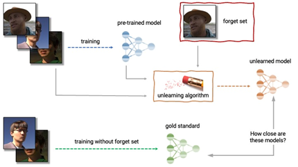

 Source: kaggle.com/competitions/neurips-2023-machine-unlearning 

Having established earlier the variety in defining and implementing unlearning methods, the approach I take is one that can be applied in the context of this competition – i.e., removing influence of samples from an age-predictor image classification deep learning model.  After literature review, I studied the paper ‘Selective Forgetting in Deep Networks’ by A. Golatkar et.al, for solving the competition’s problem, and I explain the reasoning in the future sections.

- **Paper:** Eternal Sunshine of the Spotless Net: Selective Forgetting in Deep Networks
- **Authors:** Aditya Golatkar, Alessandro Achille, Stefano Soatto (UCLA)
- **Presentation:** IEEE/ Conference on Computer Vision and Pattern Recognition, 2020
- **Proposal:** Add an L2 regularizer using Fischer Information Matrix on the samples to be retained to compute the optimal noise to destroy information

### Selective Forgetting in Deep Networks (Golatkar, A. et al. (2020))

The idea behind this paper is to develop an unlearning mechanism specific to deep neural networks.  The authors propose a definition of selective forgetting and a scrubbing procedure to implement selective forgetting in deep neural networks. 

#### Defining Unlearning using Differential Privacy: 

Most unlearning algorithms base their roots upon the field of ‘Differential Privacy’. Differential Privacy guarantees the following for each individual who contributes data for analysis to an algorithm: 
- The output of a differentially private analysis will be roughly the same, whether or not the users contribute data to the analysis.
- The algorithm hardly changes behavior when an individual joins or leaves the dataset. 
These algorithms are designed differently to ensure that the above rules uphold.

  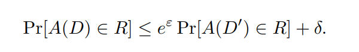

 
In the above formula, if datasets $$D$$ and $$D’$$ vary by a sample / a group of samples, the probability of algorithm $$A$$ having an output distribution in the region $$R$$ for input $$D$$ should be almost equal to the probability of the same algorithm $$A$$ an output distribution in the region R for input $$D’$$ – they can vary by a factor of $$e^ϵ$$,  where $$ϵ$$ is the privacy parameter.

The Selective Forgetting definition in this paper follows a generalized version of Differential Privacy – i.e., it does not require information about one sample to be minimized, but rather a group of samples or a subset $$D_f$$. This generalization is followed as forgetting one single sample is too difficult to enforce in deep learning.  

#### Competition’s definition of Unlearning and Scoring Policy:
One of the reasons this paper aligns with the Kaggle competition’s goals is that the competition also bases its understanding of unlearning on differential privacy. The competition first uses multiple membership inference attacks (M.I.A) on the model outputs generated by the submitted notebook. It then calculates False-Positive and False-Negative Rates based on the results of this attack. FPR measures the rate at which the attacker incorrectly claims that a data point is a member of the training dataset when it is not. FNR measures the rate at which the attacker incorrectly claims that a data point is not a member of the training dataset when it actually is. It then generates a privacy parameter $$ϵ$$ by using the formula:

  

Where $$ϵ$$ is generated by running the attack on many models trained on the same unlearning algorithm (512 in our case). This privacy parameter is the competition’s estimate of forgetting quality. Modifying our previous definition of differential privacy, the competition suggests an unlearning definition given by:

  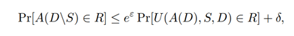

According to the above formula, true unlearning happens when an Unlearning algorithm applied on a model trained using an algorithm $$A$$ on dataset $$D$$ which contains sample-to-be-forgotten $$S$$ to be is similar to when a model is retrained from scratch using the same algorithm $$A$$ but this time without the sample-to-be-forgotten $$S$$. The lower the value of $$ϵ$$, the better.
Based on this unlearning definition, the competition uses a scoring function to assign points to the ϵ obtained using the previous formula (more points for lesser $$ϵ$$ values). Different $$ϵ$$ values are obtained by evaluating the model for different samples, and a final score is assigned by aggregation. 

#### Verifying Differential Privacy by measuring Kullback-Leibler Divergence:
In the definition of differential privacy, we saw that **the output distributions must be similar** when an algorithm is applied on a dataset ***with and without*** a forgetting sample. The authors use KL divergence to measure this similarity between output distributions. KL divergence is a non-symmetric metric that measures the relative entropy or difference in information represented by two distributions. It can be thought of as measuring the distance between two data distributions, showing how different the two distributions are from each other.

  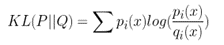

According to this formula, the similarity of distributions $$P$$ and $$Q$$ is measured by the equation given above. It is a positive number and is zero when both distributions are equal. As we saw in the previous definition of unlearning, the measurement of differential privacy for the competition is **between** a ‘newly trained model’ and ‘unlearning procedure applied on a trained model’. Similarly, the Kullback-Leibler Divergence is also modified to include the unlearning function: 

  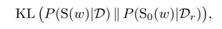

Where $$S(w)$$ is the scrubbing/unlearning function applied on a model trained on data $$D$$ which includes both Retain set and Forget Set and $$S_0(w)$$ is a model free of any scrubbing and trained from scratch on just the Retain Set. 

The mutual information (MI) of two random variables is a measure of the mutual dependence between the two variables. More specifically, it quantifies the “amount of information” obtained about one random variable by observing the other random variable. The authors finally conclude that since unlearning is a measure of forgetting information, the amount of information shared by the unlearned model’s and retrained model’s outputs is less than or equal to the KL divergence of the model represented by the Shannon Mutual Information factor (I):

  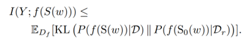

#### Unlearning Procedure used in Selective Forgetting:
Now that we have established that unlearning (modified version of differential privacy) can be measured by using KL divergence and that KL divergence is zero only when both distributions are equal, the goal of the unlearning algorithm is to minimize KL divergence. 
The authors propose that adding noise to the weights from a gaussian distribution $$(w+ σ*n)$$ where $$n$$ is the noise, helps forgetting. But adding too much noise can destroy weights that belong to the data to be retained. The optimal noise is obtained by minimizing the Lagrangian equation given below – termed as the Forgetting Lagrangian.

  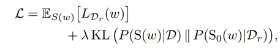

With this equation, the authors propose that the ideal noise is obtained when the loss of the ‘retain’ set is minimized subject to the KL divergence of scrubbed model and retrained model as constraint. 

Consider a deep learning model algorithm $$A$$ which goes through continuous gradient descent optimization:

  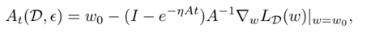

Where $$∇_w$$ is the gradient and $$A$$ is the second order gradient, also known as Hessian.

Then the scrubbing / unlearning function (after convergence) represented by :

  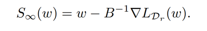

Can be used to clean the model of any information in $$D_f$$. The authors propose a more practical optimization procedure by adding the covariance of noise to the above equation which is given by

  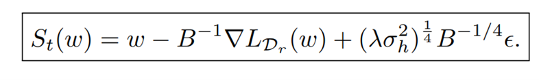

The authors further simplify the scrubbing procedure by approximating $$w$$ − $$B^{−1}∇L_{D_r}(w)$$ as $$w$$ and replacing the Hessian by the Fisher Information Matrix ($$F$$) due to computing constraints to get a simplified scrubbing procedure represented by

  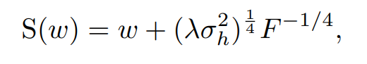

In practice, they observed that $$F^{-1/2}$$ approximates better than $$F^{-1/4}$$.

#### Implementation Details:
Based on the author’s implementation available on their GitHub page (link provided in references), I implemented a version of the above formula in the unlearning algorithm. 

The Hessian is calculated as follows by iterating through every sample in the retain set:

  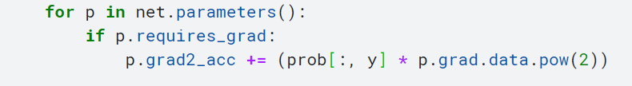

The below variables, representing the mean weights and variance to be multiplied with the noise: 

  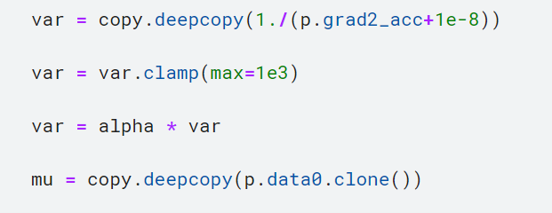

The final equation, represented by multiplying the variance with the noise, and adding it to the existing weights.

  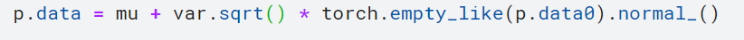

#### Submission Details:
The primary issue behind debugging an unlearning notebook like this is that the notebook is not run on the local account, but on a hidden server due to the hidden dataset requirements. No logs regarding success / failure can be accessed – which made debugging difficult. 

Steps followed through this process:
-	Initially, when I submitted by notebook, the code would run for hours and quit unexpectedly providing no details of what happened. 
-	So, I used a local CIFAR10 dataset to fix errors in code and completed run successfully on the cloud env provided by Kaggle. (Have attached notebook for reference in github – **Sunshine version 3**)

  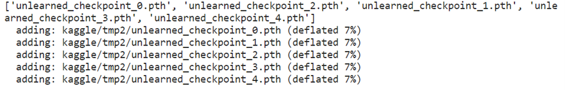

-	Even then, the submission with Google’s dataset kept failing due to timeout issues.

**Here is my analysis of the process:**

I included very small unlearning mechanisms like fine-tuning in my notebook just to check what constitutes as a valid submission. The notebook would run for 6-8 hours and give a successful score. So my assumption is that Google does not allow unlearning algorithms to run beyond a certain cut-off time in their servers. The unlearning algorithm proposed in this paper, takes a lot of time to compute the Hessian – this maybe the cause of timeout errors. 

  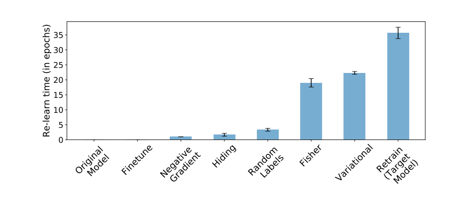

 Source: Paper – ‘Selective Forgetting in Deep Networks’ 

**Point to note:** Based on the above chart provided in the paper, the Fisher algorithm computation time takes atleast 20 times as much as a simple fine-tuning algorithm. Just the fine-tuning algorithm took 6+ hours with Google’s dataset for me. It took just minutes to complete in the CIFAR10 dataset. With the estimation provided by this paper, and comparing it with the time taken for fine-tuning, the selective forgetting algorithm may take 120+ hours which is definitely not allowed in Google servers.

Other strategies I tried:
- **Fine-tuning** (Attached notebook – Sunshine version 1): I fine-tuned the model on the remaining data Dr using a slightly larger learning rate to introduce ‘catastrophic forgetting’ which provided the following scores with different parameters.
- **Negative Gradient** (Attached notebook – Sunshine version 2): I used negative gradient on the forgetting samples instead – which is damaging features to predict the forget set correctly, which resulted in the following score.
- **L2 penalty value on the existing loss**

#### References: 
- Nguyen, T. T., Huynh, T. T., Nguyen, P. L., Liew, A. W.-C., Yin, H., & Nguyen, Q. V. H. (2022). A Survey of Machine Unlearning. In Proceedings of ACM. ACM, New York, NY, USA.

- Golatkar, A., Achille, A., & Soatto, S. (2020). Eternal Sunshine of the Spotless Net: Selective Forgetting in Deep Networks [Submitted on 12 Nov 2019 (v1), last revised 31 Mar 2020 (this version, v5)].

- Cao, Y., & Yang, J. (2015). Towards making systems forget with machine unlearning. In 2015 IEEE Symposium on Security and Privacy (pp. 463–480). IEEE.

- Ginart, A., Guan, M., Valiant, G., & Zou, J. Y. (2019). Making AI Forget You: Data Deletion in Machine Learning. In Advances in Neural Information Processing Systems (pp. 3513–3526).

- [Supporting notebook by authors of 'Selective Forgetting' paper](https://github.com/AdityaGolatkar/SelectiveForgetting/blob/master/Forgetting.ipynb)

